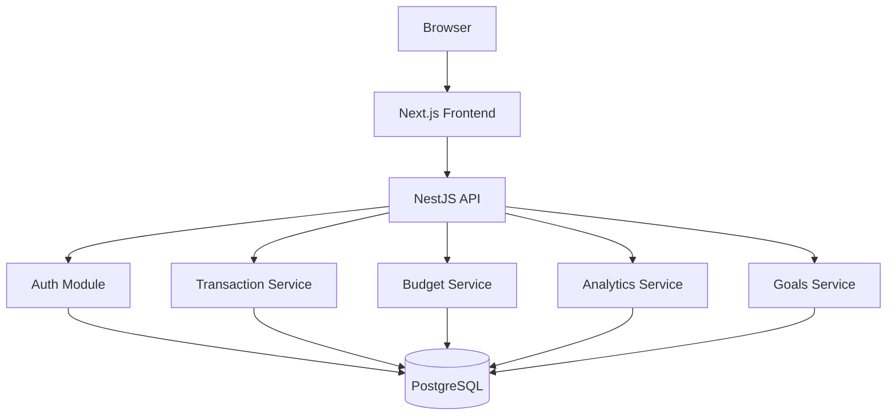

# FinTrack Architecture

## Overview

## Frontend Architecture
- **Framework:** Next.js 14 (App Router)
- **State:** TanStack Query for server state, React state for UI
- **Forms:** React Hook Form + Zod validation
- **Styling:** Tailwind CSS with custom design tokens
- **Charts:** Recharts

## Backend Architecture
- **Framework:** NestJS with modular architecture
- **Layers:** Controller → Service → Repository (Prisma)
- **Auth:** JWT with refresh token rotation, HTTP-only cookies
- **Validation:** class-validator + class-transformer
- **Docs:** Swagger/OpenAPI auto-generated

## Database
- **Engine:** PostgreSQL 16
- **ORM:** Prisma with typed client
- **Money:** `DECIMAL(18,2)` — no floating point
- **Isolation:** All queries scoped by `user_id`

## Key Decisions
1. **Monorepo (pnpm workspaces):** Shared types between frontend/backend without publishing
2. **NestJS over Fastify:** Decorator-based DI, built-in Swagger, mature ecosystem
3. **Prisma over TypeORM:** Better TypeScript integration, simpler migrations
4. **TanStack Query over Redux:** Server state belongs in a cache, not a store
5. **Decimal over float:** Financial precision is non-negotiable
